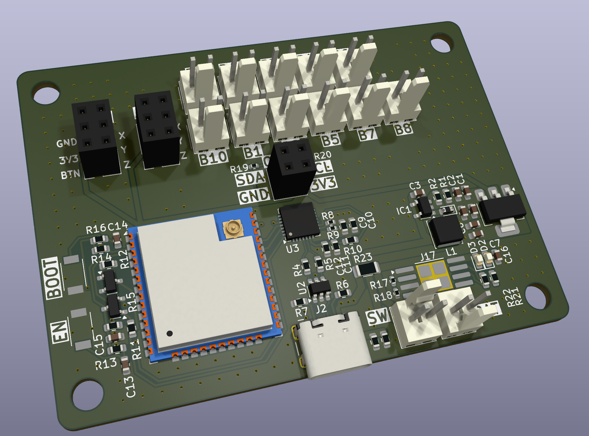

# 6 axis remote Controler
- Works over Wi-Fi ( sends constant length ASCI data frame)
- Up to 6 networks saved (with priority from  1 to 6)
- All settings of the Rc can be changed on a configuration website
- Controled inertia of the joysticks and signal values of the joystick coordinates
- Veriable signal refresh rate up to 200Hz
- Auto zero positioning (no more robots moving in slow speed without touching the pilot)
- USB-C charged!
- two 3-DOF joysticks
- 10 buttons (2 of which are on Joy Sticks)
- Integrated LCD
- The RC remembers settings so no need to set it up every time or reprogram it.


## The repo supports demo pc keyboard version of the RC 
 Pc keyboard version for RC without the need for the hardware.
 
 ```bash
  python3 -m venv .venv
  python3 -m pip -r requirements.txt
  source .venv/bin/activate
  python3 pilot_6axis/pilot_6axis/keyboard_rc.py -i IP_ADDRESS -p PORT -f FREQUENCY -v JOYSTICK_VALUE
 ```
for help
```bash
  python3 pilot_6axis/pilot_6axis/keyboard_rc.py
 ```

## To build and run ros package
```bash
  colcon build --packages-select pilot_6axis
  source install/setup.bash 
  ros2 run pilot_6axis rc_node
```


## Data frame
 Consist of 18 elements separated by ':'.
Depending on the settings int_Joystick_(left/right)_(MMin/MMax) value returned by joystick will vary. This setting values should be between -9999<=x<=9999 or 0<=x<=99999 or the data frame length won't be constant, for buttons: 1-pressed 0-not pressed.
```bash
 Example: "$Rc:  340:   200:   12:1:  500:-2045: 2045:1:1:1:0:1:1:0:1:0:#\r"
```

 1. control beginning "$Rc"
 2. joystick_left_x   (5-characters) 
 3. joystick_left_y   (5-characters)
 4. joystick_left_z   (5-characters)
 5. joystick_left_btn  (1-character)
 6. joystick_right_x   (5-characters)
 7. joystick_right_y   (5-characters)
 8. joystick_right_z   (5-characters)
 9. joystick_right_btn  (1-character)
 10. btn_1  (1-character)
 11. btn_2  (1-character)
 12. btn_3  (1-character)
 13. btn_4  (1-character)
 14. btn_5  (1-character)
 15. btn_6  (1-character)
 16. btn_7  (1-character)
 17. btn_8  (1-character)
 18. control end "#\r"

## How to use
### Setup
  1. Enable setup mode by pressing and holding the most centeral button 4 or 5 when turning the Rc On (doesn't matter which one).
  2. Connect to the Rc Wi-Fi network that is displayed on  the LCD.
  3. Open web browser and go to url displayed on the LCD.
  4. Set up the settings of the Rc and press save buttons on the bottom of the page. This will redirect you to the page where you will see if settings were saved. If you made some error it will be shown here.
  5. To leave setup mode shut down the Rc and turn it on again.
  6. Now the Rc will connect to the network with the highest priority that is available. If it can't connect to any of the saved networks it will keep trying to connect to them. If the Rc is connected to the network it will display the IP address on the LCD and show Connected status.
  7. Now setup is done and you can use the Rc.
## Settings list:
#### General Settings
  - **Joystick left MMin** -> minimum value of the left joystick x, y, z axis on the min of the range 
  - **Joystick left MMax** -> maximum value of the left joystick x, y, z axis on the max of the range
  - **Joystick left filer** -> inertia of the left joystick (0-1), the higher inertia the response of the joystick value will be faster.
  - **Joystick right MMin** -> minimum value of the right joystick x, y, z axis on the min of the range
  - **Joystick right MMax** -> maximum value of the right joystick x, y, z axis on the max of the range
  - **Joystick right filer** -> inertia of the right joystick (0-1)
  - **WIFI SSID** => SSID of the wifi network created by the RC in setup mode.
  - **WIFI PASSWORD** => password of the wifi network made by the RC in setup mode
  - **Update frequency** => frequency of sending data frame
  - **Target IP** => IP address to which the RC will send data frame
  - **Host Port** => port to which the RC will send data frame

#### WIFI target networks
  - **Wifi [number 1-6] : Seed** => SSID of the wifi network (where number means priority from 1 to 6)
  - **Wifi [number 1-6] : Password** => Password of the wifi network


## Required component list

### Component Images

  | Component | Photo | Component | Photo |
  |-----------|-------|-----------|-------|
  | PCB (order from JLCPCB) |  | Joystick 4-axis JH-D400B-M4 |  |
  | Toggle switch 6mm MTS-103 |  | Monostable switches 12mm PBS-33B |  |
  | Li-ion battery 3.7V 4000mAh |  | LCD 1.3" 128x64 OLED SSD1306 |  |
  | Antena 2.4GHz 3dBi WiFi RP-SMA |  | M3 6mm hex socket flat countersunk |  |
  | M3 heated insert M3xL3xOD4.2 |  | M3 5mm hex socket cylindrical |  |


### Component list 

  | Component Name                                   | Parts Count | Description                                              |
  |--------------------------------------------------|-------------|----------------------------------------------------------|
  | Joystick 4-axis JH-D400B-M4                      | 2           | 3-DOF joysticks for axis control                        |
  | Toggle switch 6mm MTS-103                        | 1           | Main toggle switch for power or mode selection           |
  | Monostable switches 12mm PBS-33B                 | 8           | Momentary push buttons for user input                   |
  | Li-ion battery 606090 3.7V 4000mAh               | 1           | Rechargeable battery for power supply                    |
  | LCD 1.3" 128x64 OLED SSD1306                     | 1           | Display for status and configuration                     |
  | Antena 2.4GHz 3dB WiFi 2.4GHz RP-SMA             | 1           | External Wi-Fi antenna for wireless communication        |
  | M3 6mm hex socket flat countersunk screws        | 14          | Screws for assembling the enclosure                      |
  | M3 heated insert M3xL3xOD4.2                     | 19          | Threaded inserts for secure screw mounting               |
  | M3 5mm hex socket cylindrical screws             | 4           | Additional screws for assembly                           |
  | PCB (order from JLCPCB)                          | 1           | Main circuit board for the controller                    |
  | BOM Components (see BOM file)                    | -           | All other electronic components (resistors, ICs, etc.)   |

- BOM file "Electric schematic/Pilot6Axis/jlcpcb/production_files/BOM-Pilot6Axis.csv"
- JLCB gerber files "Electric schematic/Pilot6Axis/jlcpcb/production_files/GERBER-Pilot6Axis.zip"

## How to assembly
  You figure it out.
