## Simple Kick Ass Remote Controler
- Works over Wi-Fi ( sends constant length ASCI data frame)
- With up to 6 networks saved (with priority from  1 to 6)
- All setings of the rc can be changed on a website
- Controled inertia of the joysticks (defasult 0.95) and signal values of the joystick coordinates (default -2048 to 2048 but can be anything (JUST KEEP IN UDDER ABS(val) val<=9999))
- Veriable signal refresh rate up to 200Hz
- Auto zero positioning (no more robots moving in slow speed without touching the pilot)
- USB-C charged!
- 3-DOF joysticks
- 10 buttons (2 of which are on JS)
- Integrated LCD
- RC remembers setings so no need to set it up every time or reprogram it.

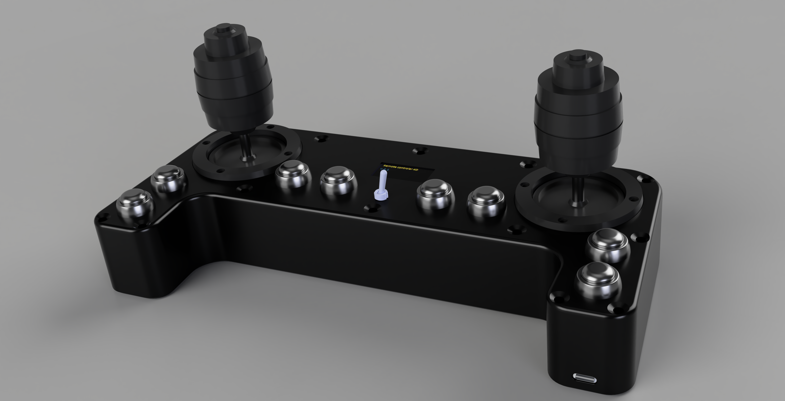
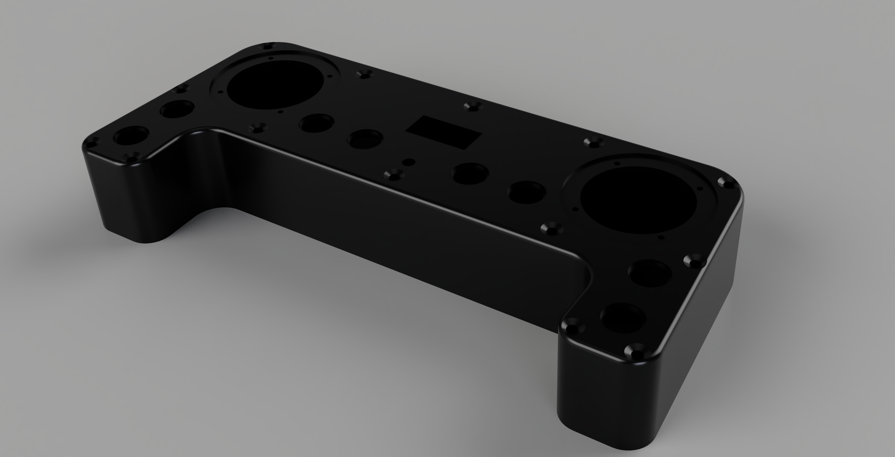

## Data frame
 Consist of 18 elemnts separated by ':'.
Depending from the setings int_Joystick_(left/right)_(MMin/MMax) value return by joystick will very. This seting values should be between -9999<=x<=9999 or 0<=x<=99999 or the data frame length won't be constant, for buttons: 1-pressed 0-not pressed.
```
 Example: "$RC:  340:   200:    12:1:  500:-2045: 2045:1:1:1:0:1:1:0:1:0:#\r"
```

 1. control beginning "$RC"
 2. joystick_left_x   (5-characters) 
 3. joystick_left_y   (5-characters)
 4. joystick_left_z   (5-characters)
 5. joystick_left_btn  (1-character)
 6. joystick_right_x   (5-characters)
 7. joystick_right_y   (5-characters)
 8. joystick_right_z   (5-characters)
 9. joystick_right_btn  (1-character)
 10. btn_1  (1-character)
 11. btn_2  (1-character)
 12. btn_3  (1-character)
 13. btn_4  (1-character)
 14. btn_5  (1-character)
 15. btn_6  (1-character)
 16. btn_7  (1-character)
 17. btn_8  (1-character)
 18. control end "#\r"

## How to use
### Setup
  1. Enable setup mode press and hold most center button 4 or 5 (doesn't metter which one).
  2. Connect to the rc Wi-Fi network that is diaplayed on  the LCD.
  3. Open web browser and go to url displayed on the LCD.
  4. Set up the setings of the rc and press save buttons on the bottom of the page. This will redirect you to the page where you will see if setings were saved. if you amde some error it will be shown here.
  6. To leave setup mode shut down the rc and turn it on again.
  7. Now the Rc will connect to the network with the highest priority that is available. If it can't connect to any of the saved networks it will keep trying to connect to them. If the rc is connected to the network it will display the IP address on the LCD and show Conencted status.
  9. Now setup is done and you can use the rc.
### Setings explained
  - int_Joystick_left_MMin -> minimum value of the left joystick  x,y,z axis in the end of the range 
  - int_Joystick_left_MMax -> maximum value of the left joystick  x,y,z axis in the end of the range
  - flo_Joystick_left_filer -> inertia of the left joystick (0.0-1.0), the higher the value response of the joystick value will be faster.
  - int_Joystick_right_MMin -> minimum value of the right joystick  x,y,z axis in the end of the range
  - int_Joystick_right_MMax -> maximum value of the right joystick  x,y,z axis in the end of the range
  - flo_Joystick_right_filer  -> inertia of the right joystick (0.0-1.0)
  - int_upd_freq  => frequendy of sending data frame
  - str_host_wifi => IP address to whitch the rc will send data frame
  - str_host_port => port to whitch the rc will send data frame
  - str_passwd  =>  password of the network of the rc in setup mode
  - str_WIFI_(number 1-6)_S =>  SSID of the network      (where number means priority from 1 to 6)
  - str_WIFI_(number 1-6)_P =>  Password of the network


## Required component list

- ESP32 DevKit V4 SP32-WROOM-32U
  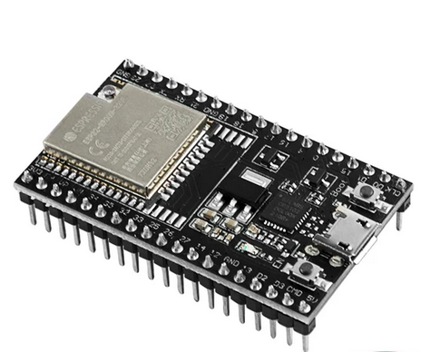

- Joystick 4-axis JH-D400B-M4
  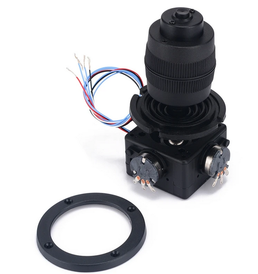

- Toggle switch 6mm x1 MTS-103  
  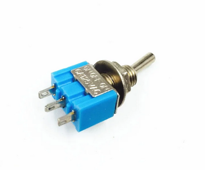

- Monostable switches 12mm x8  PBS-33B
  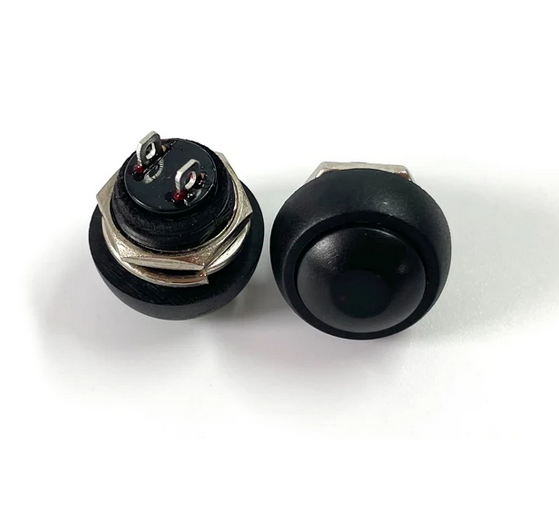

- Li-ion battery 606090 3.7V 4000mAh
  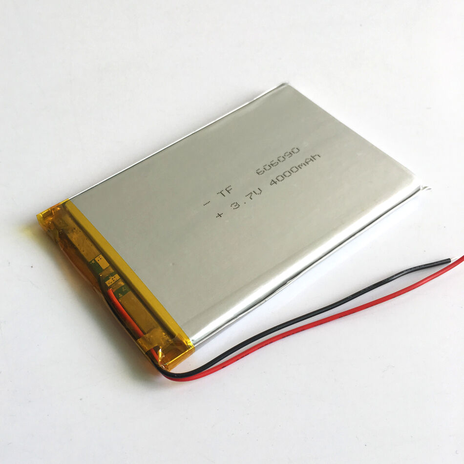

- USB-C 1S charger
  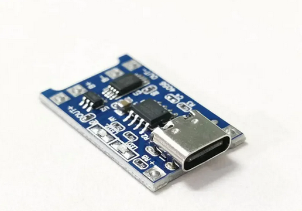

- Step up converter from li-ion to 5V
  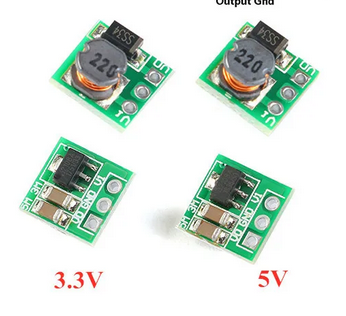

- LCD 1.3" 128x64 OLED SSD1306
  

- Antena 2.4GHz 3dBi WiFi 2.4GHz RP-SMA
  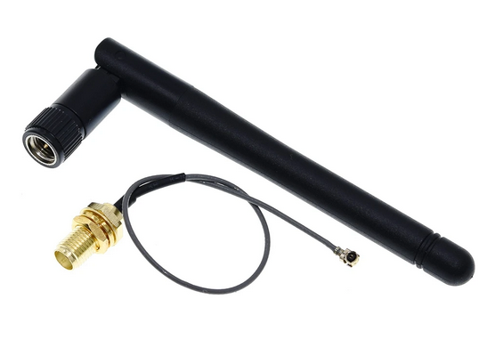

- M3 6mm hex socket flat countersunk x 14 
  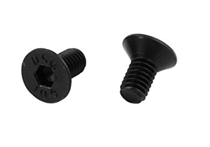

- M3 heated insert M3xL3xOD4.2 x 19
  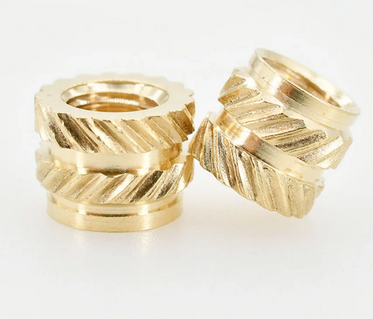

- M3 5mm hex socket cylindrical  X5 
  


## How to assembly
  You figure it out.